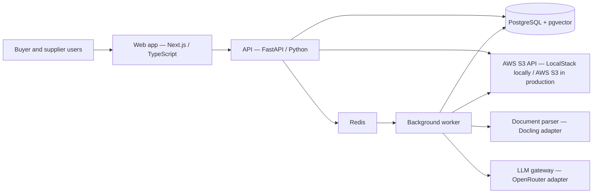

# ItemFoundry — Product and Delivery Plan

## 1. Product thesis

Build a multi-tenant SaaS platform for distributors, marketplaces, and resellers that turns inconsistent supplier product material into validated, category-specific product records.

The product is not a generic document chatbot. Its primary job is to produce trustworthy structured catalog data through a controlled, human-in-the-loop workflow:

1. A buyer/reseller imports or defines its category taxonomy and versioned field schemas.
2. The buyer invites and manages supplier organizations.
3. A supplier creates an onboarding batch containing one or more SKUs, free-form information, spreadsheets, and shared or item-specific documents.
4. The system identifies product families and trade items, parses the source material once, and makes it retrievable with stable citations.
5. An LLM recommends a product category for each product or family with evidence and confidence.
6. The supplier confirms or corrects each category.
7. An LLM extracts core product identity, category attributes, packaging, and required compliance information against the confirmed schema.
8. Deterministic buyer rules validate types, units, allowed values, conditional requirements, identity conflicts, and required documents.
9. The supplier reviews every proposed value and its source, corrects where necessary, and attests that the submission is accurate.
10. The buyer reviews prioritized exceptions, requests corrections where needed, and approves the product records.
11. Approved products are transformed through a buyer-owned output mapping and delivered as canonical JSON and/or a pilot export file.

## 2. Product boundaries

### MVP includes

- Multi-tenant buyer/reseller organizations
- Buyer users, supplier organizations, and supplier users
- Supplier invitation and account administration
- Buyer-owned category taxonomy with CSV/JSON import and export
- Versioned, category-specific JSON Schemas
- Batch onboarding through XLSX/CSV, free text, and multiple documents
- Product family, trade-item/SKU, variant, packaging, and core identifier model
- PDF, DOCX, and TXT ingestion
- Parsed blocks with page/location metadata
- Shared documents linked once to a product family or selected SKUs
- Search/retrieval scoped to one tenant, batch, family, and product
- LLM category recommendation followed by human confirmation
- Schema-constrained field extraction
- Per-field citations, confidence, and provenance
- Deterministic validation, conditional business rules, and unit normalization
- Category-level required-document and compliance checks
- Supplier review, edits, attestation, and immutable audit history
- Buyer exception workbench, correction requests, and approval
- Buyer-owned CSV/JSON output mapping, export run, and delivery status
- Canonical JSON preview and download
- Buyer operational and pilot-outcome metrics
- Job status, retries, and actionable failure messages

### Explicitly deferred

- Public supplier API access and supplier API credential management
- Prebuilt ERP/PIM/e-commerce connectors beyond the pilot export contract
- Automatic publication without human approval
- Cross-retailer shared product catalog
- Complex workflow customization
- Supplier scorecards and billing
- Localization and translation
- Image-derived attributes and image quality scoring
- Fine-tuning custom models

These are product roadmap candidates, not assumptions baked into the MVP.

## 3. Multi-tenant domain model

Use neutral domain language in code and make “Zoro” only seed/demo data.

- **Organization**: a company using the platform.
- **Buyer account**: a tenant/workspace owned by a reseller or marketplace.
- **Supplier organization**: a supplier identity that may eventually connect to several buyers.
- **Supplier relationship**: connects a supplier organization to one buyer account and governs access/status.
- **Membership**: connects a user to an organization with a role.
- **Category taxonomy**: a buyer-owned hierarchy of product categories. Each category has a buyer-written name and description that the classifier uses to distinguish it from neighboring categories.
- **Category schema version**: an immutable, buyer-defined set of normalized attributes for one category. Every attribute includes a plain-language extraction description that is supplied to the LLM and shown to the supplier reviewer.
- **Submission batch**: one supplier delivery containing one or more products, spreadsheet rows, free text, and documents.
- **Product family**: a group of related trade items that share specifications and source documents but differ by variant attributes.
- **Trade item/SKU**: the normalized sellable item. It carries supplier, manufacturer, global, and buyer identifiers without assuming they are interchangeable.
- **Product identity**: brand, manufacturer, manufacturer part number, supplier item number, GTIN/UPC where applicable, buyer SKU when assigned, and deduplication status.
- **Variant**: the attributes that distinguish members of a product family, such as size, voltage, capacity, color, or package quantity.
- **Packaging level**: each, pack, case, pallet, or another buyer-defined sellable/logistics level with quantity and dimensional information.
- **Product submission**: the per-trade-item onboarding case and authoritative workflow state within a submission batch.
- **Product document**: an uploaded source file with immutable checksum and processing state.
- **Document association**: links one parsed document to a batch, family, or selected trade items so a shared file is stored and parsed once.
- **Document block**: addressable parsed content with page, section, table, and bounding-box metadata where available.
- **Document requirement**: a buyer/category rule describing a required document type, acceptable status, revision/issue date, expiration behavior, and whether buyer review is mandatory.
- **Classification run**: candidate categories, evidence, model/prompt version, latency, token usage, and status.
- **Extraction run**: values proposed against a particular schema version with full run metadata.
- **Product field value**: proposed/edited/approved value plus provenance.
- **Supplier attestation**: immutable record of who submitted the data, when, which product revision was covered, and any acknowledged missing information.
- **Data quality issue**: a deterministic or model-assisted exception with severity, owner, resolution, and affected JSON pointer or document.
- **Buyer review decision**: approval, correction request, or rejection with reviewer, reason, and product revision.
- **Product snapshot**: immutable canonical JSON captured at approval time.
- **Output profile**: buyer-owned mapping from canonical JSON pointers to downstream column/field names and allowed transformations.
- **Export run**: immutable record of the product revisions, output profile version, generated artifact, delivery status, and errors.
- **Supplier API credential**: a revocable, scoped machine credential issued for one supplier relationship. It records its creator and usage metadata but is not owned by a human user's session.
- **Audit event**: append-only record of consequential user and system actions.

Every tenant-owned database row must carry `buyer_account_id` (or be reachable through an enforced tenant-owned parent). Repository methods and tests must make cross-tenant access impossible by default.

## 4. Roles and permissions

### Buyer roles

- **Buyer owner**: manages the account, users, and global settings.
- **Buyer admin**: manages suppliers, categories, and schema versions.
- **Catalog reviewer**: owns the buyer exception queue, requests supplier corrections, approves products, and reopens rejected/approved records.
- **Read-only analyst**: views records, run metrics, and exports.

### Supplier roles

- **Supplier admin**: manages supplier users and all submissions for that buyer relationship; later creates, scopes, rotates, and revokes supplier API credentials.
- **Supplier contributor**: creates and edits submissions assigned to them.
- **Supplier reviewer**: reviews normalized product data and submits a supplier attestation to the buyer.

MVP may combine contributor and reviewer permissions, but the data model should keep permissions separate so a buyer can require four-eyes approval. Supplier attestation never grants buyer approval. Non-admin supplier users may view the API credential inventory and usage metadata, but cannot create, rotate, revoke, or reveal credential secrets.

## 5. Batch and product state machines

The submission batch is the supplier's unit of work, but each product has an independent lifecycle. A batch can therefore contain approved, blocked, and in-progress products without hiding row-level status.

### Product submission state

```text
DRAFT
  -> INGESTING
  -> INGESTION_FAILED | READY_FOR_CLASSIFICATION
  -> CLASSIFYING
  -> CLASSIFICATION_FAILED | AWAITING_CATEGORY_CONFIRMATION
  -> EXTRACTING
  -> EXTRACTION_FAILED | AWAITING_SUPPLIER_REVIEW
  -> SUBMITTED_TO_BUYER
  -> BUYER_CHANGES_REQUESTED | APPROVED
  -> EXPORT_PENDING
  -> EXPORT_FAILED | EXPORTED

AWAITING_CATEGORY_CONFIRMATION -> CLASSIFYING      (retry)
AWAITING_SUPPLIER_REVIEW       -> EXTRACTING       (rerun against changed sources/schema)
BUYER_CHANGES_REQUESTED        -> AWAITING_SUPPLIER_REVIEW
APPROVED                       -> DRAFT_REVISION    (new revision; never mutate the approved snapshot)
EXPORT_FAILED                  -> EXPORT_PENDING    (idempotent retry)
```

### Submission batch state

```text
DRAFT -> INGESTING -> IN_PROGRESS -> AWAITING_SUPPLIER_ATTESTATION
      -> SUBMITTED_TO_BUYER -> PARTIALLY_APPROVED | APPROVED
      -> PARTIALLY_EXPORTED | EXPORTED
```

Batch state is derived from its product states except for explicit supplier submission and attestation events. Transitions occur through domain commands, not direct status updates. Each transition writes an audit event.

## 6. Proposed local architecture



### Services in Docker Compose

- `web`: Next.js, TypeScript, accessible UI, generated API client
- `api`: FastAPI, validation/domain logic, auth boundary, OpenAPI
- `worker`: the same Python codebase with a separate process for ingestion and LLM jobs
- `postgres`: system of record with pgvector enabled
- `redis`: durable-enough local queue/broker and short-lived coordination
- `localstack`: local AWS S3 emulation for source documents and generated document artifacts
- optional development profiles: mail catcher, database admin UI, tracing/metrics

The API and worker share an `ObjectStorage` adapter backed by the AWS SDK. Local configuration supplies the LocalStack endpoint, region, development credentials, and path-style addressing when required. Production omits the endpoint override and uses normal AWS credentials/roles. An idempotent LocalStack initialization script creates the required private buckets and bucket configuration during startup.

### Why this shape

- The backend API is the single application boundary. The web UI uses the same application commands that future supplier API clients will use, preventing UI and integration behavior from drifting apart.
- Python has the strongest practical document/OCR and data-validation ecosystem.
- Web and API remain independently deployable without creating premature microservices.
- Worker isolation keeps slow parsing and model calls away from request/response paths.
- PostgreSQL holds relational workflow data, JSON data, full-text indexes, and vectors in one transactional system for the MVP.
- The storage adapter uses the AWS S3 API in every environment: LocalStack supplies the local endpoint, while production can use AWS S3 without changing domain logic.
- All LLM calls go through one internal interface, so OpenRouter models and policies are configuration, not domain logic.

Start as a modular monolith with three deployable processes (`web`, `api`, `worker`). Do not split classification, extraction, and ingestion into networked services until measured scaling or ownership boundaries require it.

## 7. Suggested repository layout

```text
supplier_portal/
  apps/
    web/
  services/
    api/
      app/
        api/
        auth/
        domain/
        imports/
        ingestion/
        llm/
        retrieval/
        repositories/
        workers/
        exports/
      migrations/
      tests/
  packages/
    contracts/          # generated/shared API types and JSON schemas
  evals/
    fixtures/
    golden_records/
  infra/
    docker/
  docker-compose.yml
  .env.example
  Makefile
```

## 8. Document and retrieval pipeline

### Ingestion

1. Accept an XLSX/CSV product roster, free-form input, and zero or more supporting documents in one submission batch.
2. Validate spreadsheet headers, row identity, file extension, MIME signature, size, and checksum; report row-level problems without failing unrelated rows.
3. Resolve or create product families and trade items from explicit supplier identifiers. Flag suspected duplicates and identity conflicts for review rather than merging automatically.
4. Store every original immutable file in S3 under a tenant-scoped object key. Local development uses a LocalStack bucket created by an idempotent initialization script.
5. Associate each document with the whole batch, a product family, or selected trade items. A shared document is stored and parsed once.
6. Create idempotent ingestion jobs for spreadsheet parsing and document parsing.
7. Parse through a `DocumentParser` interface. Use Docling first because it supports local PDF/DOCX/TXT processing, OCR, layout, and tables; keep the implementation replaceable.
8. Store the parser version, structured document output, plain/Markdown representation, and addressable blocks.
9. Chunk by document structure rather than arbitrary character windows; preserve tables, model/variant columns, and heading context.
10. Generate embeddings through a configurable embedding provider and store them in pgvector.
11. Mark artifacts searchable only after all required records commit successfully; expose partial batch progress and item-level retry.

### Retrieval

- Always filter by buyer account and supplier relationship, then by batch, family, product, and document association before ranking.
- Use hybrid retrieval: PostgreSQL full-text search plus vector similarity.
- Retrieve blocks, not just flattened documents.
- Give the LLM stable block IDs and location metadata.
- Treat document text as untrusted data, never as instructions.
- Make embedding model/version part of the stored record so re-indexing is controlled.
- Permit family-level evidence to support multiple variants only when the document association and extracted table row make that relationship explicit.

### Citation rules

An extracted value is not considered supported unless it references at least one stored block. A citation contains:

- document ID and immutable file checksum
- block ID
- page number where applicable
- section/table information where available
- bounding box where available
- short supporting excerpt

The backend must verify that the cited excerpt exists in the referenced block. The UI opens the original document at the cited page and highlights the excerpt/region when the parser provides coordinates.

## 9. Classification and extraction design

### Category classification

- Classify at product-family level when all variants clearly share a category; otherwise classify individual trade items.
- Retrieve likely identity, title, and specification blocks plus relevant structured spreadsheet cells.
- Ask for the best three category candidates from the buyer's allowed taxonomy, using the buyer-defined category names, descriptions, hierarchy, and distinguishing guidance.
- Require category IDs, rationale, citations, and calibrated confidence.
- Never allow the model to invent a category ID.
- Auto-select nothing in the MVP. A supplier confirms one of the candidates or searches the taxonomy.
- Capture confirmed/corrected labels as evaluation data.

### Schema-driven extraction

- Freeze the confirmed category and schema version for an extraction run.
- Extract core product identity and packaging fields in addition to category-specific attributes.
- Translate the buyer's category field definitions into strict JSON Schema.
- Include every field's buyer-authored label, extraction description, type, unit rules, allowed values, and examples in the extraction context. The description is authoritative guidance about the business meaning of the field; it is not merely display help text.
- Extract fields in coherent groups if a schema is too large for one call.
- Use structured output-capable OpenRouter models with strict schema enforcement.
- Require `null` for unsupported values; never infer product facts from general world knowledge.
- Return raw value, normalized value, unit, confidence, and citation IDs.
- Normalize units and types in deterministic backend code after extraction.
- Validate the completed object against JSON Schema plus global, category, cross-field, conditional, identity, packaging, and required-document rules.
- Flag conflicts when two sources disagree instead of silently choosing.
- Treat supplier-entered values as supplier attestations, not document citations. Preserve author, timestamp, original value, and optional explanation.
- Never merge suspected duplicate products or variants automatically in the MVP.

### Example API representation

```json
{
  "batchId": "batch_456",
  "productId": "product_789",
  "schemaVersion": "cordless-drill@1.0.0",
  "data": {
    "identity": {
      "brand": "Example Tools",
      "manufacturerPartNumber": "DCD791D2",
      "supplierItemNumber": "SUP-10042"
    },
    "voltage": { "value": 20, "unit": "V" },
    "chuckSize": { "value": 0.5, "unit": "in" }
  },
  "evidence": {
    "/identity/manufacturerPartNumber": [
      { "sourceType": "document", "documentId": "doc_123", "blockId": "blk_018", "page": 1 }
    ],
    "/voltage/value": [
      { "sourceType": "document", "documentId": "doc_123", "blockId": "blk_042", "page": 2 }
    ],
    "/identity/supplierItemNumber": [
      { "sourceType": "supplier_attestation", "enteredBy": "user_123", "enteredAt": "2026-08-02T15:00:00Z" }
    ]
  },
  "validation": {
    "status": "needs_review",
    "issues": []
  }
}
```

Store canonical `data` separately from field evidence, supplier attestations, validation issues, and edit history. Compose the representation above at the API boundary.

## 10. LLM gateway requirements

All model calls use an internal `LLMClient` and a named task configuration such as `category_classification_v1` or `product_extraction_v1`.

Record for every run:

- tenant and product submission
- task name and prompt version
- requested model and actual provider/model when available
- request settings and schema version
- input block IDs, not only a rendered prompt
- raw response in restricted storage
- parsed response and validation failures
- token usage, estimated cost, latency, and retry count
- final run status and error category

OpenRouter routing should require providers that support requested structured-output parameters. Data retention/provider policies must be configurable for each buyer; production should default to the strictest appropriate policy rather than silently falling back to any provider.

## 11. Buyer-defined taxonomy and category schema editor

Each buyer imports or defines and owns its taxonomy. Suppliers can view the published taxonomy during onboarding but cannot change it. The same product could therefore normalize differently for two buyers without either buyer's configuration leaking into the other tenant.

The MVP supports versioned CSV/JSON import and export so an enterprise buyer can bring an existing taxonomy and field dictionary without recreating it manually. Import is staged: validate the entire file, show additions/changes/conflicts, and require buyer publication rather than partially mutating the active taxonomy.

The buyer can create a category, place it in the category hierarchy, and provide:

- category name and stable category key
- category description used by both the LLM classifier and supplier users
- parent category
- inclusion and exclusion guidance for ambiguous neighboring categories
- optional examples of products that do and do not belong in the category
- optional external classification identifiers and aliases, such as GS1 GPC or a buyer's legacy category ID

For each category, the buyer defines the normalized fields that must be extracted. The MVP should provide a safe form-based editor rather than require raw JSON. Each field needs:

- stable field key and display label
- required plain-language description written by the buyer for both the LLM and supplier reviewer
- data type
- required/optional status
- unit dimension and canonical unit
- enum values or taxonomy reference
- validation constraints
- extraction hints, synonyms, and positive/negative examples
- display order and group
- optional external attribute identifiers used for interoperability or downstream mapping

Field descriptions should answer: what the field means, what source language or labels may identify it, what must not be confused with it, how values should be normalized, and when the correct result is `null`.

Each category can also define required document types, including whether a document is always required, conditionally required, subject to expiration/revision checks, or requires buyer review regardless of extraction confidence.

Before publication, the backend validates field-key uniqueness, required descriptions, compatible type/unit constraints, valid enum definitions, external mapping uniqueness, document requirements, and generated JSON Schema validity. Publishing creates a new immutable schema version. Classification and extraction runs store the exact taxonomy/schema version supplied to the LLM. Existing approved products remain tied to the version used during approval. Schema migration is a later explicit workflow.

## 12. Supplier attestation, buyer review, and delivery

### Supplier review and attestation

The main review screen should optimize for trust and correction speed:

- source document viewer on the left
- normalized fields grouped by category on the right
- each field shows proposed value, confidence, validation state, and source link
- required missing values are prominent and editable
- low-confidence/conflicting values are reviewed first
- selecting a citation navigates to its page/region
- supplier edits require an optional reason and preserve the model proposal
- submission to the buyer is blocked only by defined hard validation failures
- attestation summary shows what was extracted, edited, missing, and acknowledged
- batch view supports filtering, bulk confirmation of non-exception fields, and item-level drill-down

Confidence is an attention-ranking signal, not a correctness guarantee.

Supplier submission creates an immutable attestation for the exact product revision. It means the supplier stands behind the information; it does not make the product buyer-approved or publishable.

### Buyer exception workbench

The buyer workbench is the operational center of the MVP. It prioritizes products and fields by:

- missing required fields or documents
- identity and suspected-duplicate conflicts
- unsupported, invalid, or unverifiable citations
- source conflicts
- low extraction confidence
- conditional and cross-field rule failures
- supplier-edited values
- expired or superseded compliance documents
- buyer policy requiring mandatory review

The buyer can inspect evidence, approve a product, reject it, or request corrections with field-level notes. A correction request reopens a new supplier revision without altering the submitted or approved snapshot. The pilot requires an explicit buyer decision; configurable auto-approval can be considered only after measured quality supports it.

### Downstream output and delivery

The buyer defines a versioned output profile mapping canonical JSON pointers to its downstream field or column names. The MVP supports:

- canonical JSON per product and batch
- configurable CSV export with buyer-selected columns and ordering
- deterministic transformations such as formatting, enum mapping, and unit presentation
- export preview and validation before generation
- immutable export artifacts in S3
- export status, item-level errors, retry, and correlation to product/schema/profile versions

The first design partner supplies a sample downstream file contract. Prebuilt PIM/ERP connectors are deferred, but the export service and audit model must allow a future connector to deliver the same versioned artifact.

### Buyer operational dashboard

The MVP reports batch and supplier throughput, completion rate, time in each workflow stage, required-field completeness, supplier correction rate, buyer exception rate, median review time, export success, ingestion failures, and estimated LLM cost per approved SKU. Pilot reporting compares these measures with the buyer's agreed baseline process.

## 13. Future supplier API design

The initial UI is API-driven even though the public supplier API is deferred. Business rules, authorization, validation, state transitions, idempotency, and audit logging must live behind backend application commands rather than inside UI handlers. Later API enablement should expose those commands through a stable, versioned public contract rather than implement a second workflow.

### Supplier API capabilities

The public `v1` API should eventually let an authorized supplier integration perform the same supplier actions available in the UI:

- create and list submission batches and product submissions
- upload product rosters and associate shared documents with families or selected products
- submit free-form product information
- upload source documents through short-lived presigned URLs
- inspect ingestion, classification, and extraction status
- retrieve category candidates and supporting evidence
- confirm or correct the product category
- retrieve normalized fields, validation issues, and citations
- edit field values and attach supplier-provided evidence
- attest and submit a product revision to the buyer when credential scope and workflow policy allow it
- retrieve the approved canonical JSON and revisions

Long-running operations return a job/resource identifier and support polling initially; signed webhooks can be added later. Mutating operations accept idempotency keys. The contract includes cursor pagination, stable machine-readable error codes, request/correlation IDs, rate-limit headers, and explicit API versioning.

### API credential rules

- Credentials are created for one supplier relationship with one buyer account, not for an individual human session. This prevents accidental access to another buyer if the supplier later works with several buyers.
- Only supplier admins can create, name, scope, set expiry for, rotate, and revoke credentials.
- A credential receives least-privilege scopes such as `submissions:read`, `submissions:write`, `documents:write`, `products:review`, and `products:attest`.
- Supplier attestation is a separate high-risk scope and can also be disabled by the buyer's policy. Buyer approval is never available to a supplier credential.
- The full secret is displayed exactly once at creation or rotation. The backend stores only a secure one-way verification digest and a non-secret prefix/last-four representation.
- After creation, supplier admins and regular supplier users can view only masked metadata: name, prefix/last four, scopes, creator, created time, expiry, last-used time, status, and recent activity. Nobody can retrieve the original secret.
- Rotation creates a new secret and supports a short, explicit overlap window before invalidating the old secret. Revocation takes effect immediately.
- Secrets are never placed in URLs, browser storage, application logs, audit payloads, or analytics.
- Every credential lifecycle action and authenticated API request is tenant-scoped and auditable.
- Rate limits and anomaly detection operate per credential and supplier relationship.

The first credential type can be a platform-issued bearer API key. Preserve an authentication abstraction so enterprise customers can later use OAuth 2.0 client credentials without changing product workflow endpoints.

### API/UI parity testing

Application-level contract tests should exercise each supplier command independent of transport. A smaller parity suite then verifies that the UI-session endpoint and public API-key endpoint produce the same state transition, validation result, authorization decision, and audit event for equivalent input.

## 14. Security and operational baseline

- OIDC-compatible authentication boundary; local development may use a local identity provider or a minimal first-party adapter.
- HttpOnly secure cookies or standards-based access tokens; never store long-lived secrets in browser storage.
- Role and tenant checks in the backend for every object access.
- API credentials are scoped to a single supplier relationship and buyer account, hashed at rest, short-lived where practical, revocable, and excluded from logs.
- Presigned, short-lived document download URLs.
- Encryption in transit and managed encryption at rest in production.
- File type/size limits and malware-scanning hook before parsing.
- Prompt-injection defense: source content is delimited and treated as untrusted evidence; model output cannot invoke tools or change workflow state.
- Secrets only through environment/secret stores; `.env.example` contains placeholders.
- Append-only audit events for invites, role changes, schema publication, category confirmation, field edits, approvals, exports, credential lifecycle changes, and supplier API activity.
- Structured logs with correlation IDs; never log document contents or credentials by default.
- Configurable source-document, raw-model-response, and approved-record retention policies with verified tenant export/deletion procedures.
- Production-pilot identity must integrate with an enterprise-compatible OIDC/SAML provider even if local development uses a minimal adapter.
- A documented software inventory, dependency/vulnerability scanning process, incident-response owner, and security-questionnaire evidence package are required before an enterprise production pilot.
- Backup/restore and retention policy designed before production pilot.

## 15. Delivery iterations and exit criteria

### Iteration 0 — Walking skeleton

Deliver:

- repository and Docker Compose foundation
- web, API, worker, Postgres/pgvector, Redis, and LocalStack S3 containers
- idempotent LocalStack bucket initialization and an S3 storage-adapter smoke test
- health checks, migrations, seed command, and one-command startup
- CI for lint, type-check, unit tests, and container build

Exit criterion: a developer can clone, configure `OPENROUTER_API_KEY`, start the stack, and see all services healthy.

### Iteration 1 — Tenancy and supplier onboarding

Deliver:

- organizations, buyer accounts, supplier relationships, memberships, roles
- buyer creates/invites supplier admin
- supplier admin creates additional supplier users
- tenant-isolation integration tests
- audit log foundation

Exit criterion: two seeded buyers and suppliers cannot access one another's data by UI or API.

### Iteration 2 — Categories and schemas

Deliver:

- buyer-owned category tree administration with category descriptions and inclusion/exclusion guidance
- staged CSV/JSON taxonomy and attribute-dictionary import with validation and change preview
- per-category form-based field definition with required LLM extraction descriptions
- external category/attribute mappings and category-level document requirements
- draft/publish schema versions
- JSON Schema plus conditional/cross-field rule generation and validation
- one realistic seeded category

Exit criterion: a buyer imports or creates and publishes a fully described category schema, the exact published definition can be rendered into LLM extraction context, and sample good/bad product JSON validates deterministically.

### Iteration 3 — Batch, identity, and document ingestion

Deliver:

- submission batches with XLSX/CSV roster, free text, and multi-file upload
- product family, trade-item/SKU, variant, packaging, and core identifier records
- spreadsheet header/row validation and row-level error reporting
- suspected duplicate and identity-conflict flags without automatic merge
- batch/family/product document association and parse-once reuse
- immutable document storage
- async parsing, block storage, OCR path, status/retry UI
- tenant/batch/family/product-scoped full-text and vector retrieval
- ingestion fixtures and parser regression tests

Exit criterion: a multi-SKU family roster plus PDF, DOCX, and TXT sample documents creates independently trackable products whose shared and item-specific evidence resolves to working page/table citations.

### Iteration 4 — Category recommendation

Deliver:

- OpenRouter gateway and run ledger
- top-three category recommendations with evidence
- supplier confirmation/correction UI
- retry/failure handling and usage metrics

Exit criterion: the golden evaluation set meets the agreed top-1/top-3 classification threshold and every recommendation cites a source block.

### Iteration 5 — Cited normalized extraction

Deliver:

- strict core identity, packaging, and category extraction against the confirmed schema version
- citation verification
- deterministic unit/type/enum, conditional, cross-field, identity, packaging, and required-document validation
- missing/conflict handling and explicit supplier-attested provenance
- extraction evaluation harness

Exit criterion: no unsupported non-null value can reach review without a resolvable citation, and field-level quality meets the agreed pilot threshold.

### Iteration 6 — Supplier review and attestation

Deliver:

- side-by-side evidence review
- batch filters and product drill-down
- edits, validation, completion checks, and correction reasons
- immutable supplier attestation and submitted revision
- complete audit trail

Exit criterion: a supplier can review a batch, resolve hard failures, attest to each submitted product revision, and hand the batch to the buyer without database/manual intervention.

### Iteration 7 — Buyer exception review and export

Deliver:

- prioritized buyer exception workbench
- field-level correction requests, rejection, and approval
- immutable approved product snapshot
- versioned buyer output profile
- canonical JSON and configurable CSV preview/export
- immutable export runs, item-level errors, retry, and delivery status
- operational and pilot-outcome dashboard

Exit criterion: a buyer can review supplier-submitted exceptions, approve product revisions, and generate an export matching the agreed downstream sample contract with full traceability.

### Iteration 8 — Pilot hardening

Deliver:

- accessibility and responsive UI pass
- security/threat-model review
- load, retry, backup/restore, and failure-injection tests
- admin operational dashboard
- data retention/provider policy controls
- enterprise-compatible identity integration and security evidence package
- deployment abstraction and future connector/API design

Exit criterion: agreed pilot SLOs, security checks, evaluation targets, and recovery procedure pass.

### Iteration 9 — Supplier API enablement

Deliver:

- versioned public supplier API based on the existing application commands
- supplier-admin credential creation, one-time secret display, rotation, revocation, expiry, and scopes
- read-only masked credential inventory and activity for regular supplier users
- idempotent submission/document/review endpoints
- polling and API usage/rate-limit visibility
- API documentation, example requests, and UI/API parity tests

Exit criterion: a supplier can complete the same batch intake, review, attestation, and buyer-submission workflow through the public API as through the UI, subject to identical tenant, role, schema, validation, and audit rules; buyer approval remains buyer-authorized, and a revoked, expired, cross-buyer, or insufficiently scoped supplier credential is denied by automated tests.

## 16. Evaluation strategy

Create a version-controlled golden dataset before optimizing prompts. Start with 30–50 representative product packets across 3–5 categories, including clean, incomplete, conflicting, table-heavy, scanned, multi-SKU, variant-matrix, and shared-document cases. Add a separate batch fixture with hundreds of synthetic or authorized SKUs for workflow and throughput testing.

Track:

- category top-1 and top-3 accuracy
- per-field precision, recall, and exact/normalized match
- citation support rate and citation correctness
- required-field completion rate
- supplier edit rate per field/category
- supplier attestation completion and turnaround time
- suspected-duplicate precision and unresolved identity-conflict rate
- buyer exception and correction-request rate
- median human review time per product
- batch throughput and time in each workflow stage
- ingestion/OCR failure rate
- LLM latency and cost per completed product
- export validation/success rate
- percentage of products requiring mandatory buyer attention
- improvement against the design partner's baseline review time, rework rate, and cost per approved SKU

Prompt/model changes must run against the golden dataset before promotion. Store results by prompt, model, parser, embedding model, and schema version to detect regressions and drift.

## 17. Highest-risk assumptions to test early

1. **Evidence quality:** PDF tables and scanned sheets may not yield page/region citations reliably.
2. **Product boundaries:** one file may contain several SKUs or a family/variant matrix; the batch/family/item association must avoid applying a shared specification to the wrong variant.
3. **Schema quality:** extraction can only be as precise as the buyer's field definitions, units, enums, and examples.
4. **Missing versus inferred data:** suppliers may expect the system to fill gaps from external sources. MVP must clearly distinguish supplied evidence from enrichment.
5. **Conflicting sources:** precedence rules need human visibility rather than hidden LLM judgment.
6. **Tenant privacy:** sending supplier documents through routed model providers may require strict provider/retention controls and contractual review.
7. **Economics:** parsing, embeddings, classification, and extraction costs must be measured per completed SKU from the first vertical slice.
8. **Identity and duplicates:** supplier item number, manufacturer part number, GTIN, buyer SKU, variant, and packaging level may conflict or be reused inconsistently.
9. **Downstream fit:** technically correct canonical JSON has limited value if it cannot be mapped cleanly into the buyer's actual catalog/PIM contract.
10. **Workflow adoption:** supplier attestation and buyer exception review must reduce total handling time rather than relocate work between teams.

## 18. First vertical slice

Build the first end-to-end demo around:

- one seeded buyer account (“Demo Industrial Supply”)
- one supplier organization and two supplier users
- one category with 10–15 fields (a cordless drill is a manageable starting example)
- one product submission with a spec-sheet PDF plus free text
- category recommendation and confirmation
- extraction with resolvable citations
- supplier correction of one deliberately wrong/missing value
- supplier attestation, buyer approval, and normalized JSON download

This slice exercises the architecture and trust model without requiring bulk ingestion or a broad taxonomy.

## 19. Design-partner MVP pilot

After the single-product engineering slice, validate the product with a bounded enterprise pilot:

- one buyer organization
- two or three supplier organizations
- three to five representative categories
- hundreds of SKUs across clean, incomplete, conflicting, shared-document, and variant-family cases
- XLSX/CSV plus PDF, DOCX, TXT, and free-form intake
- imported buyer taxonomy, category fields, rules, and document requirements
- supplier attestation followed by buyer exception review and approval
- canonical JSON plus one buyer-specific CSV/JSON downstream export contract
- baseline and post-pilot measurements for review time, rework, completeness, correction rate, throughput, and cost per approved SKU

The buyer must provide or approve a pilot data contract containing representative raw submissions, taxonomy/category definitions, expected normalized records, exception examples, and the required downstream output format. Synthetic fixtures remain useful for engineering but do not replace this design-partner evidence.

## 20. Decisions for the next planning pass

Recommended defaults are in parentheses:

- first pilot category and real sample documents (**one medium-complexity category, 10–15 fields**)
- first-party local auth versus containerized OIDC (**OIDC boundary, simplest local adapter for the vertical slice**)
- first buyer downstream sample contract (**versioned CSV plus canonical JSON for the MVP**)
- buyer review policy (**explicit buyer decision in the pilot, with the workbench prioritizing exceptions**)
- core identity and duplicate rules for the first category (**brand + MPN + supplier item number, with GTIN where available**)
- embedding provider through OpenRouter or a separate/local model (**provider adapter; start with a hosted embedding model**)
- whether a supplier identity can connect to multiple buyers in the MVP (**model it, expose one buyer relationship initially**)
- acceptable pilot accuracy, latency, cost, and review-time targets (**baseline first, then set thresholds using the golden set**)

## 21. Immediate next action

Scaffold Iteration 0 and add seed data for the first vertical slice. Before implementing the LLM calls, collect or create at least five representative product packets, one small multi-SKU/variant roster, the first category schema, and a sample buyer output contract. Those artifacts become the initial evaluation set and prevent prompt-driven development against a single happy-path document.
